# ITSL / Statistical Learning

Goal: to develop an accurate model of how **input variables** (or **independent variables**, or **predictors**, or **features** denoted by $X$ with a subscript) affect the **output variable** (or **dependent variable**, or **response**, denoted with a $Y$).

More generally, we observe a quantitative response $Y$ and $p$ different predictors, $X_{1}, X_{2}, ..., X_{p}$, then we can write the general form:
$$
\begin{equation}
Y = f(X) + \epsilon
\tag{2.1}\end{equation}
$$
where $X = (X_{1}, X_{2}, ..., X_{p})$ and $\epsilon$ is a **random error term**, independent of $X$ and with mean of 0. $f$ is the _systematic_ information that $X$ provides about $Y$. Also, $f$ is generally unknown.

There are two main reasons to estimate $f$ - **prediction** and **inference**.

## Prediction

A set of inputs $X$ are available, but the output $Y$ cannot be easily obtained. In this case, since the error term averages 0, we can predict $Y$ using:
$$
\begin{equation}
\hat{Y} = \hat{f}(X)
\end{equation}\tag{2.2}
$$

where $\hat{Y}$ is a estimate of $Y$.

$\hat{Y}$ will never be exactly $Y$ because even if $\hat{f}$ can become $f$ (if we were to use the best statistical learning technique to achieve $f$), even if all of the **reductible error** can be found, there is still $\epsilon$ to sway the result as the **irreductible error**.

While it's assumed that $\epsilon$ has a mean of 0, the irreductable error is larger than 0 because there may be terms that are useful in predicting $Y$, but since they are not measured, $f$ cannot use them. The rest of $\epsilon$ may also contain unmeasurable variation.

Given an estimate $\hat{f}$ and a set of predictors $X$, yielding the prediction $\hat{Y} = \hat{f}(X)$, and assumming for a moment that both $\hat{f}$ and $X$ are fixed, so that the only variability comes from $\epsilon$, then it can be shown that:

$$
\begin{align}
\text{E}(Y-\hat{Y})^2 = \text{E}[f(x)+\epsilon+\hat{f}(X)]^2\\
=[f(x) - \hat{f}(X)]^2_\bold{Reductible} + \text{Var}(\epsilon)_\bold{Irreductible}
\end{align}\tag{2.3}
$$

where $\text{E}(Y-\hat{Y})^2$ is the average, or **expected value** of the squared difference between the predicted and actual value of $Y$, and where $\text{Var}(\epsilon)$ represents the **variance** associated with the error term $\epsilon$.

The focus of the book is on techniques for estimating $f$ with the aim of minimizing the reductible error. It is important to keep in mind that the irreductible error will always provide an upper bound on the accuracy of our prediction for $Y$. This bound is almost always unknown in practice.

Example:
- company conducts a direct-marketing campaign
- goal is to identify individuals who are likely to respond positively to a mailing
- demographic variables are predictors $X_{1}, ..., X_{p}$
- response to campaign is the outcome $Y$
- company is not interested in understanding relationship between predictors and response
- company simply wants to accurately predict the response using the predictors

## Inference

Here, the focus is on understanding the association between $Y$ and $X_{1}, ..., X_{p}$. Thus, we wish to estimate $f$, but the goal is not necessarily to make predictions for $Y$. Here, $\hat{f}$ cannot be treated as a black box, because we need to know its exact form. Questions like:

- _Which predictors are associated with the response?_ Only a small subset of available predictors are substantially associated with $Y$, so it's desirable to identify these _important_ predictors.
- _What is the relationship between the response and each predictor?_ It is desirable to know the relationship between $Y$ and a particular predictor and, depending on the complexity of $f$, the relationship between predictors themselves.
- _Can the relationship between $Y$ and each predictor be adequately summarized using a linear equation, or is the relationship more complicated?_ Historically, most methods for estimating $f$ have taken a linear form, which is reasonable and even desirable in some circumstances. But often, the true relationship is complicated and a linear model may not provide an accurate representation of the relationship between input and output variables.

Example:
- company creates an advertising campaign
- but! goal is to identify which media have an effect on sales (ie. to understand the relationship between predictors and outcome)

Example of both at once:
- real estate company gathers demographic data as well as sales data
- inference: tries to understand the relationship between crime rate, zoning, distance from a river, air quality, schools, income level of community, size of houses, ($X_{1}, ..., X_{p}$) etc.. INCLUDING the price of the house ($Y$) - _How much more is a house worth if it has a river view?_
- prediction: given the relationship between factors, predict value - _Is this house under- or over-valued?_

## In general...

Depending on whether ultimate goal is prediction, inference or combination of both, different methods for estimating $f$ may be appropriate. For example, **linear models** allow simple, interpretable inference but are not as accurate. In contrast, highly non-linear approaches can be more accurate but at the expense of less interpretable model for which inference can be challenging.

## How $f$ is estimated

The data used to estimate $f$ is called **training data**. Most statistical learning methods for this task acan be characterized as either **parametric** or **non-parametric**.

### Parametric Methods

Parametric methods involve a two-step model-based approach:

1. First, an assumption about the shape of $f$ is made (ie. $f$ is linear in $X$):
$$
\begin{equation}
f(X) = \beta_{0} + \beta_{1}X_{1} + \beta_{2}X_{2} + ... + \beta_{p}X_{p}
\end{equation}\tag{2.4}
$$
Assumming this is a linear model greatly simplifies the problem because the only thing that needs to be found are $p+1$ coefficients $\beta_{0},\beta_{1},...\beta_{p}$. The alternative would have been to find an arbitrary p-dimensional function $f(X)$.

2. Next a **fitting** or **training** method is used for estimating the parameters in $(2.4)$. A common approach is **(ordinary) least squares** (discussed in Ch.3). However, there are other methods (discussed in Ch.6).

If the chosen model is too far from $f$, choosing more **flexible** models, which include more parameters, may be the solution. However, more complex models may lead to following errors too closely, or **overfitting**.

Example:
$$
\text{income} \approx \beta_{0} + \beta_{1} \times \text{education} + \beta_{2} \times \text{seniority}
$$

### Non-Parametric Methods

Non-parametric equations don't make explicit assumptions about the functional form of $f$. Instead they aim to estimate $f$ as close to the data points as possible without being too rough or too wiggly. These models can more accurately estimate $f$, AS LONG AS they have enough data to do so.

Ex:
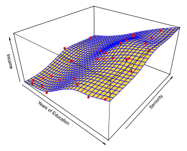
<figcaption align="center">Fig. 2.5 - Smooth <b>thin-plate</b> spline fit to Income data</figcaption>

Compare the above with the image below, where the data is _overfit_. There is more variability in the spline, but this result will fit the test or real world data worse, because it is _overtrained_.

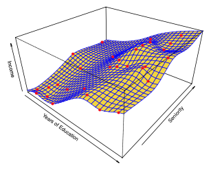
<figcaption align="center">Fig. 2.6 - Rough <b>thin-plate</b> spline fit to Income data</figcaption>

## Prediction Accuracy vs Model Interpretability

Generally, as model flexibility increases, interpretability decreases:

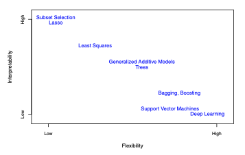
<figcaption align="center">Fig. 2.7 - A representation of the tradeoff between flexibility and interpretability, using different statistical learning methods.</figcaption>

With that in mind, flexible statistical learning methods are not always the best choice, even when interpretability is not a concern (ie. when only the prediction matters), because of the tendency of these models to overfit.

## Supervised vs Unsupervised Learning

Most statistical learning problems fall into one of two categories: **supervised** or **unsupervised**.

Supervised learning is where we can see an associated response to inputs.

Ex: logistic regression

Unsupervised learning is where we cannot see an associated response to inputs (ie. there is a lack of response variable to "supervise" the analysis).

Ex: **cluster analysis** or clustering, where the goal is to ascertain whether the observations fall into relatively distinct groups.

While many problems fall naturally into the _supervised_ or _unsupervised_ learning paradigms, some don't. For example, for $m$ observations, where $m<n$, both predictor measurements and response measuremement exist. For the rest $n-m$ observations, only the predictor measurements exist. This could be the case when it is inexpensive to gather predictors but expensive to collect responses. In this case, this is a **semi-supervised** learning problem.

## Regression vs Classification

**Quantitative** variables take on numerical values. Problems involving a quantitative response are referred to as **regression** problems.

**Qualitative** variables take on values in one of $K$ different _classes_, or categories. Problems involving a qualitative response are referred to as **classification** problems.

With that said, the distinction is not always that crisp. Least squares linear regression is used with a quantitative response, whereas logistic regression is typically used with a qualitative (two-class, or **binary**) response. Thus, despite its name, logistic regression is s classification method (since it estimates class probabilities, it can be thought of as a regression method as well). Also, some statistical methods, such as $K$-nearest neighbours and boosting can be used in the case of either quantitatie or qualitative responses.

Statistical learning methods are selected depending on whether the response is quantitative or qualittative. Whether the predictors are qualitative or quantitative is generally considered less important because they can be properly _coded_ before the analysis is performed.

## Assessing Model Accuracy

Since different models will perform differently (ie. better or worse) over different data sets, there is a need to develop techniques for measuring model accuracy and precision.

**Mean Squared Error (MSE)** is a commonly-used measure in regression settings:
$$
\begin{equation}
MSE=\frac{1}{n}\displaystyle\sum^n_{i=1}(y_{i} - \hat{f}(x_{i}))^2
\end{equation}\tag{2.5}
$$

Computed using training data, so technically, it's the _Training MSE_. Actually, we're interested in MSE for unseen data - we want to know if $\hat{f}(x_0)$ is approximately equal to $y_0$, where $(x_0, y_0)$ is a _previously unseen test observation not used to train the statistical learning method_. We want to choose the method that gives the lowest _Test MSE_, as opposed to the lowest training MSE. In other words, we compute:
$$
Ave(y_0 - \hat{f}(x_0))^2
\tag{2.6}
$$
... the average square prediction error for these test observations $(x_0, y_0)$. We select a model for which this quantity is as small as possible.

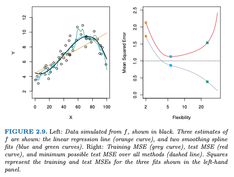

To clarify, in the _Flexibility_ figure above:
- dashed line: minimum possible test MSE over all methods, aka. $Var(\epsilon)$, aka. _irreductible error_
- grey curve: Training MSE, shape of curve is said to _decline monotonically_
- red curve: Test MSE
- two orange values at Flexibility=2 (degrees of freedom): straight line
- two blue values: _softly_ sinusoidal curve that better fits the original (black curve)
- two green values: wriggly sinusoidal curve that loosely fits the original

Notice that there _is_ an optimal amount of flexibility that will vary between data sets. Also, Training MSE will almost always be smaller than the Test MSE, because the statistical learning methods either directly or indirectly seek to minimize the Training MSE.

More examples:

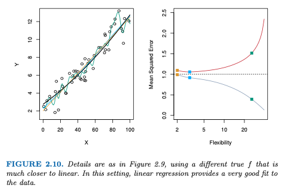

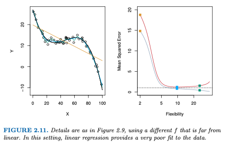

So then, the aim is to bring the two points together and minimize the Training and Test MSE's. An important method for doing so is called _cross-validation_, which aims to testimate Test MSE using _training_ data.

### Bias-Variance Trade-Off

The U-shaped curve of the Test MSE turns out to be a product of two competing properties of statistical learning methods. The Test MSE can be decomposed into the sum of three fundamental quantities:
- the _variance_ of $\hat{f}(x_0)$,
- the squared _bias_ of $\hat{f}(x_0)$,
- and the variance of the error terms $\epsilon$.
$$
E(y_0 - \hat{f}(x_0))^2 = Var(\hat{f}(x_0)) + [Bias(\hat{f}(x_0))]^2 + Var(\epsilon)
\tag{2.7}
$$

Then, to minimize Test MSE, simultaneously minimize _variance_ and _bias_ of a statistical learning method.

_Variance_:
The amount by which $\hat{f}$ would change if a different training data set would be used. Ideally, $f$ would not vary too much between training sets. However, if a method has high variance, small changes in the training data can result in large change in $\hat{f}$.

_Bias_:
The error that is introduced by approximating a real-life problem, which may be extremely complicated, by a much simpler model. Generally, more flexible methods result in less bias.

Generally, as more flexible methods are used, the variance will increase and the bias will decrease. Minimizing the two is a recurring theme throughout this book.

### Classification

Since $y_i$ is _qualitative_, the most common approach for quantifying the accuracy of $\hat{f}$ is the training _error rate_, the proportion of mistakes that are made applying $\hat{f}$ to the training observations, aka. the fraction of incorrect classifications, aka. the **training error rate**:
$$
\frac{1}{n}\sum^n_{i=1}I(y_i \not = \hat{y_i})
\tag{2.8}
$$

where:
- $\hat{y_i}$ is the predicted class label for the $i$th observation using $\hat{f}$,
- $I(y_i \not = \hat{y_i})$ is an _indicator variable_ that equals 1 (classified incorrectly) if $y_i \not = \hat{y_i}$ and 0 if $y_i = \hat{y_i}$ (classified correctly)

Similarly to regression, classification is also interested in the **test error rate** (instea of the _training_ one):
$$
Ave(I(y_0 \not = \hat{y_0}))
\tag{2.9}
$$
where:
- $\hat{y_0}$ is the _predicted class label_ that results from applying the classifier to the test observation with predictor $x_0$

A good classifier is one for which the test error (2.9) is smallest.

#### The Bayes Classifier

The idea is that, by assigning each observation to the most likely class, given its predictor values, the test error rate is minimized:
$$
Pr(Y=j|X=x_0)
\tag{2.10}
$$
...meaning: we assign a test observation with predictor vector $x_0$ to the class $j$ for which the _conditional probability_ is highest.

Ex 1: In a two-class problem (class 1 and 2), $Y=1$ (class 1) is assigned if the probabilty is higher than 0.5, and class 2 is assigned otherwise.

Ex 2:
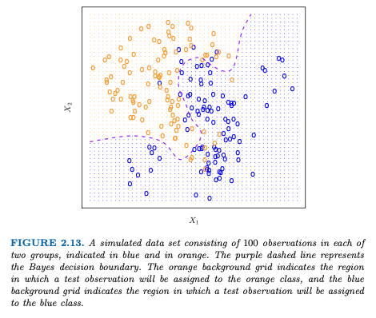
where:
- the orange shaded region reflects the set of points for which $Pr(Y=orange|X) > 0.5$,
- the blue shaded region indicates the set of points for which the probability is below 50%,
- the purple dashed line represents the points where the probability is exactly 50%, called the **Bayes decision boundary**

The Bayes classifier produces the lower possible test error rate, called the **Bayes error rate**.
$$
BER = 1 - E(\underset{j}{max} Pr(Y=j|X))
\tag{2.11}
$$
where:
- the expectation averages the probability over all possible values of $X$
- ranges between 0 (good) and 1 (bad)

**The Bayes Error Rate is analogous to the Irreductible Error (regression)**

Issue is, the Bayes classifier is just an ideal, because for real data, the conditional distribution of $Y$ given $X$ is _unknown_! So, _computing the Bayes classifier is impossible_! Therefore, the Bayes classifier serves as an unattainable gold standard against which to compare other methods.

#### K-Nearest Neighbors (KNN)

KNN estimates the conditional distribution of $Y$ given $X$ and then classifies a given observation to the class with the highest _estimated_ probability:
$$
Pr(Y=j|X=x_0) = \frac{1}{K}\sum_{i\in\mathcal{N}_0}I(y_i=j)
\tag{2.12}
$$
where:
- $K$ is a positive integer,
- $x_0$ is a test observation,
- $\mathcal{N}_0$ are the $K$ points in the training data that are closest to $x_0$

In other words, KNN:
1. identifies the $K$ points in the training data that are closes to $x_0$ (as $\mathcal{N}_0$),
2. estimates the conditional probability for class $j$ as the fraction of points in $\mathcal{N}_0$ whose response values equal $j$,
3. classifies the test observation $x_0$ to the class with the largest probabiilty from (2.12).

Ex 1:
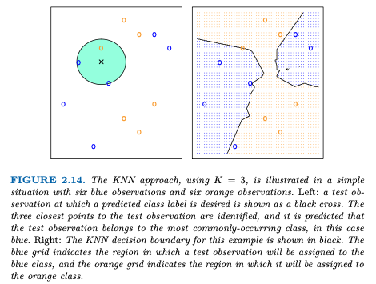
The left panel is an example of how the decision boundary is created. Iterating over the entire page of data using the process in the left panel creates the right panel.

Ex 2:
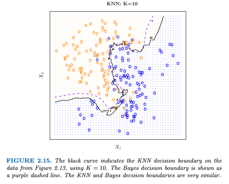
Interestingly enough, KNN is actually pretty good at estimating the Bayes decision boundary! KNN test error rate above is 0.1363 whereas the BER is 0.1304!

Similar to regression, the bias-variance trade-off applies.
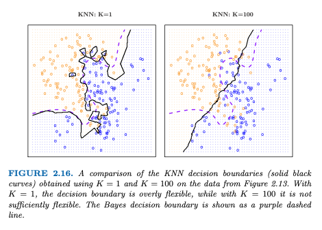

Low values of $K$ result in a training error rate of 0 but a high test error rate. Plotting error rate vs $1/K$ below (1/K because the graph becomes _more flexible_ towards the right), the same U-shape is revealed in the Test error rate as for regression. Notice also the training error is 0 at $K=1$.
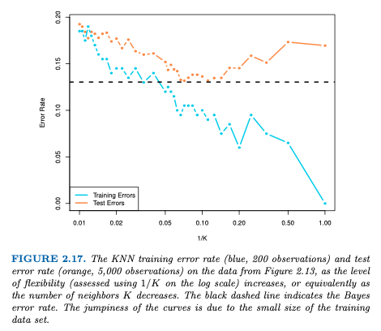
