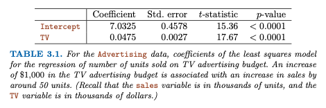

# ITSL / Linear Regression

Given a dataset, these are some questions that may need answering:
- Is there a relationship between predictors and outcome?
- How strong is the relationship between predictors and outcome?
- Which predictors are associated with the outcome?
- How large is the association between each predictor and the outcome?
- How accurately can we predict future outcomes?
- Is the relationship linear?
- Is there synergy/interaction among the predictors?

## Simple Linear Regression

Assumes a linear relationship between $X$ and $Y$:
$$
Y \approx \beta_{0} + \beta_{1}X
\tag{3.1}
$$

which can be also read as _regressing $Y$ on $X$ (or $Y$ onto $X$)_. $\beta_0$ and $\beta_1$ are two constants that represent the _intercept_ and the _slope_ in the linear model. Together, they are **model coefficients** or **parameters**.

Using training data to estimate $\hat\beta_0$ and $\hat\beta_1$, predicting future outcomes is simple:
$$
\hat{y} = \hat\beta_{0} + \hat\beta_{1}x
\tag{3.2}
$$
where $\hat{y}$ is a prediction of $Y$ on the basis of $X=x$.

Very common approach of minimizing **closeness** is using the **least squares** criterion. The difference between _each_ of the $i$th observed response value and the $i$th response value predicted by the linear model is called the **residual** and must be calculated. The values are then squared, making up the *Residual Sum of Squares (RSS)*:
$$
RSS = e_{1}^2 + e_{2}^2 + ... + e_{n}^2
$$

Then, $\hat\beta_0$ and $\hat\beta_1$ are found using _sample means_:
$$
\text{see ITSL}
\tag{3.4}
$$
This will be the **least squares coefficient estimates** for simple linear regression.

Ex:

Also, an example of minimizing RSS:

**Assessing the Accuracy of the Coefficient Estimates**

The relationship between $X$ and $Y$ for some unknown function $f$ and mean-zero random error term $\epsilon$ (because most likely the true relationship is not linear, so some relationships are missed):
$$
Y = \beta_0 + \beta_1X + \epsilon
\tag{3.5}
$$

Equation 3.5 gives us the _best_ linear approximation to the true relationship between $X$ and $Y$ - the **population regression line** (which is not generally known, as opposed to the _linear regression line_, which is the calculated estimate). This is the result of using a _sample_ to estimate characteristics of a large _population_.

Re: bias - calculating a single $\hat\mu$ (sample mean) will be relatively close to the population mean $\mu$. Calculating a large number of sample means will make the resulting $\hat\mu$ **unbiased**. Also to note, a single $\hat\mu$ is not systematically under- or over-estimating $\mu$.

The amount by which $\hat\mu$ differs from $\mu$ is called the **Standard Error (SE)**:
$$
Var(\hat\mu) = SE(\hat\mu)^2 = \frac{\sigma^2}{n}
\tag{3.7}
$$
where:
- $\sigma$ is the standard deviation of each of the realizations of $y_i$ of $Y$
- **GIVEN** that the $n$ observations are uncorrelated!

In the same vein, the same SE's can be calculated for $\hat\beta_0$ and $\hat\beta_1$.
$$
\text{see ITSL}
\tag{3.8}
$$

Also to note, $\sigma^2$ is not known but can be calculated from the data. It is known as the **residual standard error** and can be used to compute **Confidence Intervals**.
$$
\text{see ITSL}
\tag{3.9, 3.10, 3.11}
$$

Ex: Given the _advertising_ ($X$) and _sales_ ($Y$) data, the confidence intervals are computed:
$$
\beta_0: [6.130, 7.935]\\
\beta_1: [0.042, 0.053]
$$
It can be said with 95% confidence that, in the absence of any advertising, sales will, on average, fall somewhere between 6,130 and 7,935 units. Furthermore, for each $1,000 increase in television advertising, there will be an average increase in sales between 42 and 53 units.

Standard errors can also be used to perform **hypothesis tests** on the coefficients:

Null Hypothesis:
$$
H_0: \text{There is no relationship between X and Y}\\
\text{or}\\
H_0: \beta_1 = 0
\tag{3.12}
$$

Alternate Hypothesis:
$$
H_a: \text{There is some relationship between X and Y}\\
\text{or}\\
H_a: \beta_1 \not= 0
\tag{3.13}
$$
since if $\beta_1 = 0$, then the model (3.5) reduces to $Y = \beta_0 + \epsilon$ and $X$ is not associated with $Y$.

**To test the null hypothesis, we need to determine whether $\hat\beta_1$ is sufficiently far from zero that we can be confident that $\beta_1$ is non-zero. How far is far enough? Depends on $SE(\hat\beta_1)$.**

If SE is small, then even small values of $\hat\beta_1$ may provide strong evidence that $\beta_1 \not= 0$ and hence there is a relationship between $X$ and $Y$.

If SE is large,, the $\hat\beta_1$ must be large in absolute value in order to reject the null hypothesis.

In practice, the **t-statistic** is computed, which measures the number of standard deviations that $\hat\beta_1$ is away from 0:
$$
\text{see ITSL}
\tag{3.14}
$$

Then the **p-value** is derived and interpreted as such:
**a small p-value indicates that it is unlikely to observe such a substatial association between the predictor and the response due to chance, in the absence of any real association between the predictor and the response.** In other words, **a small p-value infers that there is an association between the predictor and the response**. This _rejects the null hypothesis_ (ie. there IS a relationship between $X$ and $Y$).

Typical values are 1% or 5%.

Ex:

Given the p-values in the table, the chance of seeing such values if $H_0$ is true are virtually 0. Hence $\beta_0 \not = 0$ and $\beta_1 \not = 0$.

A small p-value for the intercept indicates that we can reject the null hypothesis that $\beta_0 = 0$, and a small p-value for TV indicates that we can reject the null hypothesis that $\beta_1 = 0$. Rejecting the latter null hypothesis allows us to conclude that there is a relationship between TV and sales. Rejecting the former allows us to conclude that in the absence of TV expenditure, sales are non-zero.

**Assessing the Accuracy of the Model**

Once null hypothesis is rejected in favour of the alternative hypothesis, the next aim is to determine _the extent to which the model fits the data_. This is done using two related quantities:

- the _residual standard error_ (RSE)
  - the average amount that the response will deviate from the true regression line;
  - an estimate of the standard deviation of $\epsilon$;
  - an absolute measure of the _lack of fit_ measured in the units of $Y$;
  - RSE in the example from Table 3.2 is "3.26" aka. 3260 units;
  - Given the mean is 14000, that's a 23% error marging;
  - It depends on the problem context whether that is acceptable, as it's not always clear what makes a good RSE;
  - Generally, the smaller the value, the better.
- the $R^2$ statistic
  - complements RSE by taking the form of a _proportion_ between 0 and 1 - the proportion of variance explained;
  - independent of the scale of Y;
  - involves Total Sum of Squares (TSS) and Residual Sum of Squares (RSS)
  - TSS: measures the total variance in the response $Y$; the amount of variability inherent in the response before the regression is performed;
  - RSS: amount of variabilityt that is left unexplained after performing the regression
  - $TSS - RSS$ then measures the amount of variability in the response that is explained (or removed) by performing the regression;
  - $R^2$ then measures the _proportion of variability in $Y$ that can be explained using $X$_;
  - closer to 1 means the response is closely explained by the regression;
  - when closer to 0, maybe because the linear model is wrong, the error variance $\sigma{^2}$ is high, or both;
  - just like RSE, "a good $R^2$ value" depends on the application;

$$
R^2 = \frac{TSS - RSS}{TSS} = 1 - \frac{RSS}{TSS}
\tag{3.17}
$$

Kind of cool:
Correlation $r = Cor(X,Y)$ is also a measure of the linear relationship between $X$ and $Y$, ie. ONLY for two variables. In this case $R^2 = r^2$. For multiple variables, $R^2$ fills the role.

## Multiple Linear Regression

An extended simple linear regression model that directly accommodates multiple predictors $p$:

$$
Y = \beta{_0} + \beta{_1}X_1 + \beta{_2}X_2 + ... + \beta{_p}X_p + \epsilon
\tag{3.19}
$$

The model produced will have coefficients different than computing a single regression model for every predictor because simple regression _ignores_ other predictors, while multiple regression _holds them fixed_.

It also makes sense that one predictor (newspaper) has very low correlation to the outcome (sales) in a multiple regression model but has high correlation in a single regression model.

Ex: Shark attacks and ice cream sales would also have high correlation in a single regression model. Once a multiple regression model is introduced and temperature is brought into consideration, the shark attacks variable's correlation will drop.

Once a **correlation matrix** is generated, it's easy to see (ex: newspaper/radio combo at 0.35) that some predictors are really just surrogates of another. In this case, mediums where newspaper did well were also mediums where radio did well).

Overall, we're interested in answering:
1. Is at least one of the predictors $X_1, X_2, ..., X_p$ useful in predicting the response?
2. Do all the predictors help to explain $Y$, or is only a subset of the predictors useful?
3. How well does the model fit the data?
4. Given a set of predictor values, what response value should we predict, and how accurate is our prediction?

