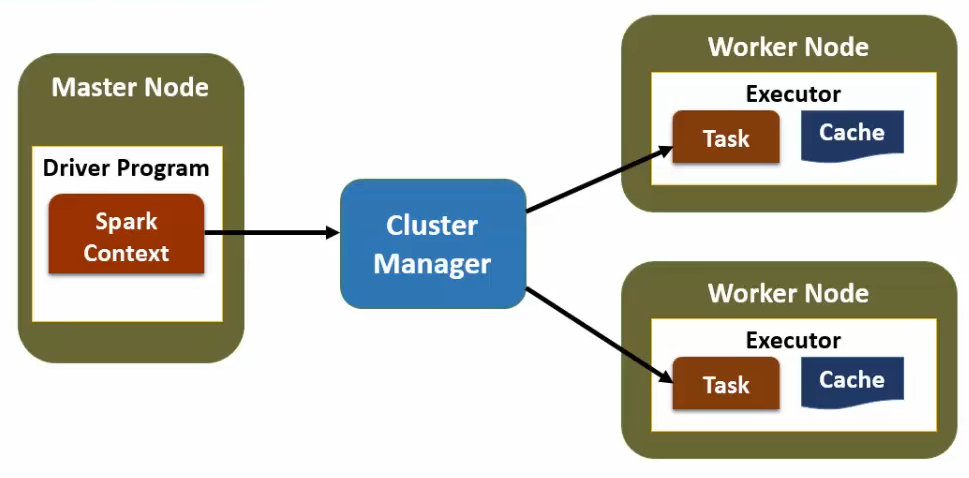

# Introduction

## Spark Framework

- **Programming:** Scala, Python, R, Java, other tools through JDBC connection
- **Library:** Spark SQL, ML Lib, GraphX, Streaming
- **Engine:** Spark Core
- **Management:** YARN, Mesos, Spark Scheduler
- **Storage:** Local, HDFS, S3, RDBMS, NoSQL

## Resilient Distributed Datasets (RDD)

Spark is built around actions performed on RDDs (create, transform, analyze, store).

Dataset contains a collection of elements of any type (strings, lines, rows, objects, collections).

Dataset can be partitioned and distributed across multiple nodes.

RDDs are immutable (can't be changed) => transformations on existing RDDs create new RDDs.

RDDs can be cached and persisted.

## Spark Architecture

Scalability:

- Single JVM (single box, for development)
- Managed Cluster (production environment)

## Driver Program

Main executable program, controls and coordinates all operations.

Executes parallel operations on a cluster.

Defines RDDs.

## Spark Context

Driver accesses Spark functionality through SparkContext object. 

Represents a connection to the cluster. Used to build RDDs.

Works with the Cluster Manager.

Manages executors, splits jobs, partitions RDDs, distributes them and collects results.

## Spark Modes

- Interactive mode (runs Spark commands one by one)
- Batch mode (through the scheduler at intervals)
- Streaming mode (run program continuously as data arrives)

## Lazy Evaluation

Spark won't load or transform data until an action is performed.

Ex:

1. Load file into RDD
2. Filter the RDD
3. Count number of elements `step 1, 2, 3 performed`

Chaining commands is possible but is not evaluated in one shot, but using the rule above.

Errors only appear at `step 3`

